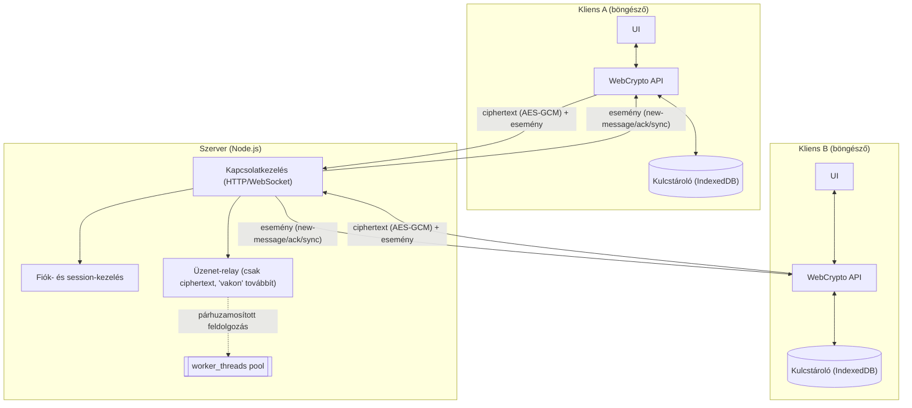

# Rendszerarchitektúra — áttekintés

Az alábbi ábra a tervezett üzenetküldő rendszer nagy vonalakban vett
felépítését mutatja: két, egymással egyenrangú kliens (böngészőben futó
HTML/JS alkalmazás) és egy közöttük/alattuk elhelyezkedő Node.js szerver.
A két kliens között nincs alá-fölé rendeltségi viszony, ezért az ábrán
egymás mellett, tükrözve szerepelnek; a szerver csak közvetít köztük.

**1. ábra:** a tervezett rendszer komponensei és az adatfolyam iránya. A
kapcsolódási pont mindkét kliens esetén konkrétan a **WebCrypto API**
komponens — nem a kliens egésze —, mert csakis onnan hagyhatja el
ciphertext formájában az üzenet a böngészőt, és csak oda érkezhet vissza
dekódolásra. A szerver oldalán a **Kapcsolatkezelés** a belépési pont,
ami a Fiók- és session-kezelés, illetve az Üzenet-relay felé ágazik szét.

## A komponensek szerepe

**Kliens (böngésző, mindkét oldalon azonos felépítéssel):**

- **UI** — a felhasználói felület, ami a nyers (titkosítatlan) üzeneteket
  kezeli a felhasználó szemszögéből
- **WebCrypto API** — itt történik a tényleges titkosítás/dekódolás,
  mielőtt az üzenet elhagyja a klienst; ez az egyetlen komponens, ami
  ténylegesen kommunikál a szerverrel
- **Kulcstároló (IndexedDB)** — a hosszú távú és session-kulcsok
  böngészőn belüli, perzisztens tárolása

**Szerver (Node.js):**

- **Kapcsolatkezelés** — HTTP/WebSocket kapcsolatok fogadása és
  szétosztása a másik két komponens felé; ez az egyetlen komponens,
  amivel a kliensek közvetlenül kapcsolatba lépnek
- **Fiók- és session-kezelés** — bejelentkezés, jogosultságok, illetve
  annak nyilvántartása, mely kliens melyik WebSocket-kapcsolaton aktív
  éppen (ez kell a `new-message` esemény célba juttatásához)
- **Üzenet-relay** — a titkosított (ciphertext) üzenetek továbbítása a
  címzett kliens felé, a tartalom megismerése nélkül ("vak" relay); a
  metaadatok (feladó, címzett, időbélyeg) ellenőrzése is itt történik
- **`worker_threads` pool** — a relay által induított, CPU-igényesebb
  feldolgozási lépések (pl. nagyobb üzenetek metaadat-validálása)
  párhuzamosítására, ha a terhelés indokolja — maga a relay logika ettől
  függetlenül, egyetlen szálon fut

## Üzenetküldés és -fogadás — eseménykezelés

Az **1. ábra** nyilai szándékosan kétirányúak: a szerver-kliens kapcsolat
nem egyszerű kérés-válasz, hanem tartós (WebSocket) kapcsolat, amin
mindkét irányban önállóan, aszinkron módon közlekednek üzenetek és
esemény-jellegű üzenetek.

**Küldés (kliens → szerver → címzett kliens):**

1. A UI réteg átadja a nyers üzenetet a WebCrypto rétegnek.
2. A WebCrypto a Kulcstárolóból vett munkamenet-kulccsal titkosítja
   (AES-GCM), és a ciphertext-et a szervernek küldi egy WebSocket-üzenet
   formájában.
3. A szerver a `worker_threads` pool segítségével (ha a terhelés
   indokolja) ellenőrzi a metaadatokat (feladó, címzett, időbélyeg), majd
   **eseményként** ("new-message") továbbítja a címzett aktív
   WebSocket-kapcsolatára, a tartalom megismerése nélkül.

**Fogadás (szerver → kliens, eseményalapú):**

1. A kliens a WebSocket-kapcsolatán feliratkozik a szervertől érkező
   eseményekre (`new-message`, `presence`, `delivery-ack`).
2. Amikor a szerver egy `new-message` eseményt küld, a kliens
   eseménykezelője elkapja azt, a ciphertext-et átadja a WebCrypto
   rétegnek dekódolásra, majd a UI-t frissíti az új, immár nyers
   üzenettel.
3. A kliens visszaküld egy `delivery-ack` eseményt a szervernek (ez nem
   az üzenettartalomra, csak a metaadatra vonatkozik), amit a szerver
   továbbít a küldő félnek — így a küldő oldali UI jelezheti, hogy az
   üzenet megérkezett.
4. Kapcsolat-megszakadás esetén a kliens újracsatlakozáskor egy
   `sync` eseménnyel lekéri a lekésett üzeneteket — ez a szerveroldali
   session-kezelés feladata (ki milyen üzeneteket nem kapott még meg).

Ez az eseményalapú modell azért fontos tervezési döntés, mert így a
szerver nem kell, hogy "tudja", mikor van a kliens éppen aktív — a
kapcsolat élettartama alatt bármikor érkezhet esemény bármelyik irányból,
ami jól illeszkedik az XMPP stanza-alapú, aszinkron üzenetküldési
modelljéhez is (ld. [Chat alkalmazás
alternatívák](research/chat-alternatives.md)).

## Kulcsfontosságú tervezési elv

A szerver **soha nem fér hozzá** a titkosítatlan üzenethez — a
titkosítás/dekódolás kizárólag a kliens oldalon, a WebCrypto API-n
keresztül történik. Ez a valódi végpontok közötti titkosítás (E2EE)
lényege: a szerver kompromittálódása esetén sem olvashatók vissza a
korábbi üzenetek.

A kulcskezelés részletesebb tárgyalása — beleértve azt, hogy a titkos
kulcs mennyire kötődik egy adott böngészőhöz, és hogyan lehetne több
eszközön is használni — a [Titkosítás](research/encryption.md) oldalon
található.
