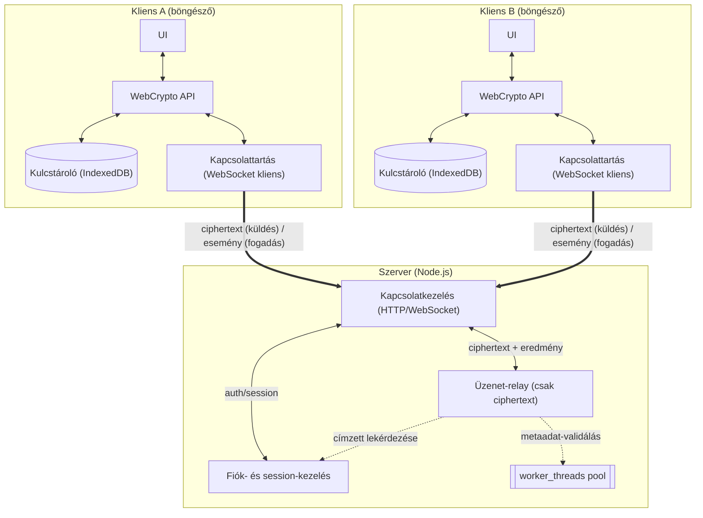
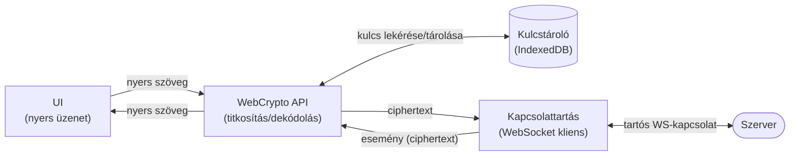

# Rendszerarchitektúra — áttekintés

Az [1. ábra](#1-abra) a tervezett üzenetküldő rendszer nagy vonalakban vett
felépítését mutatja: két, egymással egyenrangú kliens (böngészőben futó
HTML/JS alkalmazás) és egy közöttük/alattuk elhelyezkedő Node.js szerver.
A két kliens között nincs alá-fölé rendeltségi viszony, ezért az ábrán
egymás mellett, tükrözve szerepelnek; a szerver csak közvetít köztük.

*(A nyíl vizuálisan egyirányúnak tűnik, de a kapcsolat ténylegesen
kétirányú — ezt a felirat és a szöveges magyarázat jelzi. Az egyirányú
él-jelölés a diagram elrendezését segíti: enélkül a Mermaid automatikus
rendezője véletlenszerűen helyezte a szervert hol fölé, hol alá a
klienseknek.)*

**1. ábra:** a tervezett rendszer komponensei és az
adatfolyam iránya.

A kliens oldalon a kapcsolattartásért kifejezetten a **Kapcsolattartás
(WebSocket kliens)** komponens felel — ez tartja a tartós kapcsolatot a
szerverrel, és ez ad át/vesz át ciphertext-et a WebCrypto API-tól. A
WebCrypto API tehát csak titkosít/dekódol, magát a hálózati kapcsolatot
nem kezeli — ezt korábban a diagram nem különítette el, ami
félreérthető volt. A szerver oldalán a **Kapcsolatkezelés** tölti be
ugyanezt a szerepet.

A [2. ábra](#2-abra) egy kliens felépítését mutatja részletesebben,
hogy ez a négy komponens és a köztük futó adat jobban kivehető legyen
a fő ábra túlzsúfolása nélkül:

**2. ábra:** egy kliens (böngésző) belső felépítése
részletesen.

A [1. ábra](#1-abra)-n a vastag nyilak (kliens ↔ szerver) mindig a
**Kapcsolatkezelés** komponensnél végződnek — ez az egyetlen belépési
pont a szerver oldalán. A szerveren belüli vékony nyilak **kétirányúak
és címkézettek**: a Kapcsolatkezelés a Fiók- és session-kezeléstől
auth-választ kap, az Üzenet-relay-től pedig a továbbítás eredményét. A
szaggatott nyilak egyirányú **lekérdezések**: a Relay az ACC-től
kérdezi le, melyik kapcsolaton aktív a címzett, a metaadat-validálást
pedig párhuzamosítva a worker pool-nak adja át (ezekre nem érkezik
önálló válasz-üzenet, ezért egyirányú a nyíl).

## A komponensek szerepe

**Kliens (böngésző, mindkét oldalon azonos felépítéssel):**

- **UI** — a felhasználói felület, ami a nyers (titkosítatlan) üzeneteket
  kezeli a felhasználó szemszögéből
- **WebCrypto API** — itt történik a tényleges titkosítás/dekódolás,
  mielőtt az üzenet elhagyja a klienst; ez a komponens **nem**
  kommunikál közvetlenül a szerverrel
- **Kulcstároló (IndexedDB)** — a hosszú távú és session-kulcsok
  böngészőn belüli, perzisztens tárolása
- **Kapcsolattartás (WebSocket kliens)** — a szerverrel fenntartott
  tartós kapcsolatért felel; ez az egyetlen komponens, ami ténylegesen
  kommunikál a szerverrel — a WebCrypto API-tól kapott ciphertext-et
  küldi tovább, és a szervertől érkező eseményeket adja vissza neki

**Szerver (Node.js):**

- **Kapcsolatkezelés** — HTTP/WebSocket kapcsolatok fogadása és
  szétosztása a másik két komponens felé; ez az egyetlen komponens,
  amivel a kliensek közvetlenül kapcsolatba lépnek
- **Fiók- és session-kezelés** — bejelentkezés, jogosultságok, illetve
  annak nyilvántartása, mely kliens melyik WebSocket-kapcsolaton aktív
  éppen (ez kell a `new-message` esemény célba juttatásához)
- **Üzenet-relay** — a titkosított (ciphertext) üzenetek továbbítása a
  címzett kliens felé, a tartalom megismerése nélkül ("vak" relay); a
  metaadatok (feladó, címzett, időbélyeg) ellenőrzése is itt történik
- **`worker_threads` pool** — a relay által induított, CPU-igényesebb
  feldolgozási lépések (pl. nagyobb üzenetek metaadat-validálása)
  párhuzamosítására, ha a terhelés indokolja — maga a relay logika ettől
  függetlenül, egyetlen szálon fut

## Üzenetküldés és -fogadás — eseménykezelés

Bár az [1. ábra](#1-abra) kliens-szerver nyilai vizuálisan (elrendezési
okból) egyirányúak, a kapcsolat ténylegesen kétirányú: a szerver-kliens
kapcsolat nem egyszerű kérés-válasz, hanem tartós (WebSocket) kapcsolat,
amin mindkét irányban önállóan, aszinkron módon közlekednek üzenetek és
esemény-jellegű üzenetek.

**Küldés (kliens → szerver → címzett kliens):**

1. A UI réteg átadja a nyers üzenetet a WebCrypto rétegnek.
2. A WebCrypto a Kulcstárolóból vett munkamenet-kulccsal titkosítja
   (AES-GCM), és a ciphertext-et átadja a Kapcsolattartás (WebSocket
   kliens) komponensnek.
3. A Kapcsolattartás a nyitva tartott WebSocket-kapcsolaton elküldi a
   ciphertext-et a szervernek.
4. A szerver a `worker_threads` pool segítségével (ha a terhelés
   indokolja) ellenőrzi a metaadatokat (feladó, címzett, időbélyeg), majd
   **eseményként** ("new-message") továbbítja a címzett aktív
   WebSocket-kapcsolatára, a tartalom megismerése nélkül.

**Fogadás (szerver → kliens, eseményalapú):**

1. A kliens Kapcsolattartás komponense a WebSocket-kapcsolatán
   feliratkozik a szervertől érkező eseményekre (`new-message`,
   `presence`, `delivery-ack`).
2. Amikor a szerver egy `new-message` eseményt küld, a Kapcsolattartás
   elkapja azt, a ciphertext-et átadja a WebCrypto rétegnek dekódolásra,
   ami a UI-t frissíti az új, immár nyers üzenettel.
3. A kliens visszaküld egy `delivery-ack` eseményt a szervernek (ez nem
   az üzenettartalomra, csak a metaadatra vonatkozik), amit a szerver
   továbbít a küldő félnek — így a küldő oldali UI jelezheti, hogy az
   üzenet megérkezett.
4. Kapcsolat-megszakadás esetén a kliens újracsatlakozáskor egy
   `sync` eseménnyel lekéri a lekésett üzeneteket — ez a szerveroldali
   session-kezelés feladata (ki milyen üzeneteket nem kapott még meg).

Ez az eseményalapú modell azért fontos tervezési döntés, mert így a
szerver nem kell, hogy "tudja", mikor van a kliens éppen aktív — a
kapcsolat élettartama alatt bármikor érkezhet esemény bármelyik irányból,
ami jól illeszkedik az XMPP stanza-alapú, aszinkron üzenetküldési
modelljéhez is (ld. [Chat alkalmazás
alternatívák](research/chat-alternatives.md)).

## Kulcsfontosságú tervezési elv

A szerver **soha nem fér hozzá** a titkosítatlan üzenethez — a
titkosítás/dekódolás kizárólag a kliens oldalon, a WebCrypto API-n
keresztül történik. Ez a valódi végpontok közötti titkosítás (E2EE)
lényege: a szerver kompromittálódása esetén sem olvashatók vissza a
korábbi üzenetek.

A kulcskezelés részletesebb tárgyalása — beleértve azt, hogy a titkos
kulcs mennyire kötődik egy adott böngészőhöz, és hogyan lehetne több
eszközön is használni — a [Titkosítás](research/encryption.md) oldalon
található.
