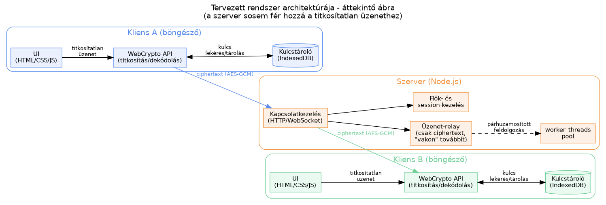

# Rendszerarchitektúra — áttekintés

Az alábbi ábra a tervezett üzenetküldő rendszer nagy vonalakban vett
felépítését mutatja: két kliens (böngészőben futó HTML/JS alkalmazás) és
egy Node.js szerver.

*3. ábra: a tervezett rendszer komponensei és az adatfolyam iránya.*

## A komponensek szerepe

**Kliens (böngésző):**

- **UI** — a felhasználói felület, ami a nyers (titkosítatlan) üzeneteket
  kezeli a felhasználó szemszögéből
- **WebCrypto API** — itt történik a tényleges titkosítás/dekódolás,
  mielőtt az üzenet elhagyja a klienst
- **Kulcstároló (IndexedDB)** — a hosszú távú és session-kulcsok
  böngészőn belüli, perzisztens tárolása

**Szerver (Node.js):**

- **Kapcsolatkezelés** — HTTP/WebSocket kapcsolatok fogadása
- **Üzenet-relay** — a titkosított (ciphertext) üzenetek továbbítása a
  címzett kliens felé, a tartalom megismerése nélkül ("vak" relay)
- **Fiók- és session-kezelés** — bejelentkezés, jogosultságok
- **`worker_threads` pool** — a szerveroldali feldolgozás
  párhuzamosítására, ha a terhelés indokolja

## Kulcsfontosságú tervezési elv

A szerver **soha nem fér hozzá** a titkosítatlan üzenethez — a
titkosítás/dekódolás kizárólag a kliens oldalon, a WebCrypto API-n
keresztül történik. Ez a valódi végpontok közötti titkosítás (E2EE)
lényege: a szerver kompromittálódása esetén sem olvashatók vissza a
korábbi üzenetek.

A kulcskezelés részletesebb tárgyalása — beleértve azt, hogy a titkos
kulcs mennyire kötődik egy adott böngészőhöz, és hogyan lehetne több
eszközön is használni — a [Titkosítás](research/encryption.md) oldalon
található.
