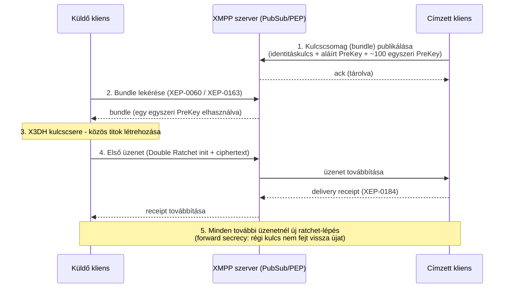
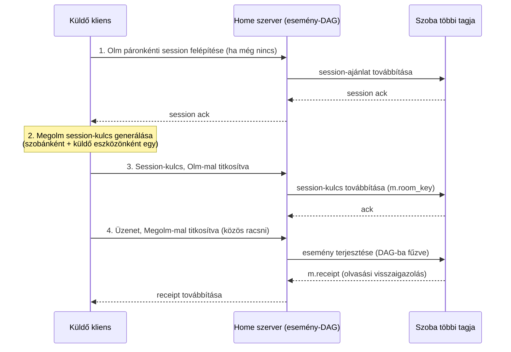

# Chat alkalmazás alternatívák

**Cél:** hasonló, létező megoldások áttekintése ahhoz a tervezett
alkalmazáshoz, amely egy kis közösség/család számára készülő, saját
szerveren futtatható, minimalista, végpontok között titkosított
üzenetküldő rendszer, XMPP-elvekre építve.

## Protokoll szint

### XMPP

**Hivatalos oldal:** [xmpp.org](https://xmpp.org/) | **Szabvány:**
[RFC 6120](https://datatracker.ietf.org/doc/html/rfc6120) (core),
[RFC 6121](https://datatracker.ietf.org/doc/html/rfc6121) (IM)

1999-ben, eredetileg Jabber néven indult, azóta az IETF szabványosította,
és mára több mint 400 kiegészítő protokoll (XEP) épült rá. Az üzenetek
XML-alapú "stanza"-kban (`<message>`, `<presence>`, `<iq>`) közlekednek
egy folyamatosan nyitva tartott TCP-kapcsolaton keresztül. Ez pontosan az
az irány, amit a projekt is követ: könnyű, saját hosting-ra alkalmas,
decentralizált protokoll (federáció: különböző szerverek felhasználói
tudnak egymással kommunikálni, mint az e-mailnél).

Erőforrás-igénye kifejezetten alacsony — egy 1 GB RAM-os VPS-en egy XMPP
szerver a memória mindössze kb. 1,4%-át használta, míg egy ugyanott futó
Matrix szerver 27,7%-ot.

Az E2EE nála nem alapértelmezett, hanem az **OMEMO**
([XEP-0384](https://xmpp.org/extensions/xep-0384.html)) kiegészítésen
keresztül érhető el, ami a Signal Protocol Double Ratchet algoritmusára
épül, de XMPP-kompatibilis kulcscsere-mechanizmussal. A technikai
működés dióhéjban: minden eszköz publikál egy **kulcscsomagot**
("bundle") — egy Ed25519 azonosító kulcsot, egy aláírt PreKey-t, és
kb. 100 egyszer-használatos PreKey-t —, amit a **PEP**
([XEP-0163](https://xmpp.org/extensions/xep-0163.html), a Personal
Eventing Protocol) és a mögötte lévő **PubSub**
([XEP-0060](https://xmpp.org/extensions/xep-0060.html)) mechanizmuson
keresztül tesz közzé. Amikor egy másik felhasználó üzenetet szeretne
küldeni, lekéri ezt a csomagot, és ezzel indítja el az X3DH-szerű
kezdeti kulcscserét, amit aztán a Double Ratchet visz tovább — az
üzenettartalom titkosítására AES-256-CBC + HMAC-SHA256 kombinációt
használ. Mivel ez az egész a meglévő XMPP-infrastruktúrára (PubSub)
épül, **szinte semmilyen szerveroldali módosítást nem igényel** — ez
az egyik fő oka annak, hogy OMEMO-t viszonylag könnyű hozzáadni egy
meglévő XMPP-szerverhez. Mivel ez csak kiegészítés, egy szerver
teljesen szabványos maradhat úgy is, hogy sosem támogatja az OMEMO-t.
Népszerű szerver-implementációk: [Prosody](https://prosody.im/),
[ejabberd](https://www.ejabberd.im/).

Az alábbi szekvenciadiagram a fent leírt lépéseket foglalja össze, a
visszaigazolásokkal (ack/receipt) együtt — a valóságban ez sem
egyirányú: a szerver és a felek is nyugtázzák az egyes lépéseket:

**1. ábra:** OMEMO (XMPP) — üzenetküldés folyamata a kulcscsomag
publikálásától az első titkosított üzenetig, a szerver és a felek
visszaigazolásaival együtt.

### Matrix

**Hivatalos oldal:** [matrix.org](https://matrix.org/) | **Specifikáció:**
[spec.matrix.org](https://spec.matrix.org/)

Újabb protokoll, esemény-alapú architektúrával: minden szoba egy
eseménygráf (DAG - Directed Acyclic Graph), amit a résztvevő szerverek
egymás között replikálnak (hasonló elven, mint egy elosztott adatbázis).
Az E2EE-t az **Olm** (páronkénti, 1:1 munkamenetekhez, a Signal Protocol
Double Ratchet-jének implementációja) és a **Megolm** (csoportos
szobákhoz optimalizált) algoritmusok biztosítják, alapból bekapcsolva.
A Megolm technikailag eltér az OMEMO/Signal megközelítéstől: nem
minden résztvevőhöz külön Double Ratchet munkamenetet tart fenn (ami
egy 200 fős szobában 199 külön munkamenetet jelentene), hanem **egy
közös, csak-előre-forgatható (one-way) racsnit** használ szobánként és
küldő eszközönként — ezt a kezdeti kulcsot Olm-on keresztül,
titkosítva osztja meg minden résztvevővel. Ennek következménye egy
tudatos biztonsági kompromisszum: aki megszerzi egy adott ponton a
racsni állapotát, **onnantól előre** tud minden üzenetet visszafejteni
(amíg a kliens újra nem indítja a munkamenetet), viszont a korábbi
üzeneteket nem — ez gyengébb garancia, mint az OMEMO/Signal
üzenetenkénti kulcsváltása, cserébe nagy létszámú szobáknál
számításigényben sokkal hatékonyabb. Erős a hídépítő (bridging)
képessége más platformok (Discord, Telegram, IRC) felé. Cserébe jóval
nagyobb erőforrást igényel, és a hivatalos szerver-szoftver
([Synapse](https://github.com/element-hq/synapse)) admin oldalról
nehézkesebb, mint az XMPP szerverek — újabb, könnyebb implementációk
(pl. [Conduit](https://conduit.rs/)) ezen próbálnak javítani.

Az alábbi szekvenciadiagram a Megolm session-kulcs terjesztésének és a
csoportos titkosításnak a folyamatát mutatja, a szoba többi tagjának
visszaigazolásaival együtt:

**2. ábra:** Matrix (Olm/Megolm) — csoportos üzenetküldés folyamata.
Jól látszik a különbség az OMEMO-hoz (1. ábra) képest: ott minden
üzenethez páronkénti ratchet-lépés történik, itt egy szobánkénti közös
racsni-kulcsot osztanak meg egyszer, Olm-mal titkosítva.

### Signal

**Hivatalos oldal:** [signal.org](https://signal.org/) | **Protokoll
dokumentáció:**
[signal.org/docs](https://signal.org/docs/)

A legelterjedtebb, iparági referenciának számító E2EE megoldás — innen
ered a Signal Protocol/Double Ratchet is, amit az XMPP OMEMO és a Matrix
Olm/Megolm is átvett. Nem alkalmas viszont a projekt céljaira, mert
alapvetően centralizált: a Signal szervere zárt forráskódú, nincs
hivatalos, interoperábilis módja annak, hogy valaki saját szerveren
futtassa, kompatibilis módon a hivatalos Signal-hálózattal.

### Kisebb, kevésbé elterjedt alternatívák

- **[Session](https://getsession.org/)** — Signal-fork, decentralizált,
  Oxen blokklánc-alapú üzenettovábbítással (nincs központi szerver)
- **[Briar](https://briarproject.org/)**, **[Tox](https://tox.chat/)** —
  peer-to-peer megoldások, alacsony elterjedtség
- **[Delta Chat](https://delta.chat/)** — e-mail alapú (SMTP/IMAP fölé
  épített E2EE réteg, Autocrypt szabvánnyal), bárkinek van már e-mail
  címe, de a szolgáltatók nem-szabványos implementációi miatt
  kompatibilitási problémák adódhatnak

## Konkrét alkalmazás szint

| Alkalmazás/szoftver | Link | Típus | Titkosítás | Miben hasonlít a projekthez |
|---|---|---|---|---|
| **Snikket** | [snikket.org](https://snikket.org/) | Előre konfigurált, Docker-alapú XMPP szerver | OMEMO (alapból bekapcsolva) | Pontosan erre a célra készült: család/baráti kör könnyen üzemeltetheti saját szerveren, minimális beállítással |
| **Conversations / Dino** | [conversations.im](https://conversations.im/) / [dino.im](https://dino.im/) | XMPP kliens (Android / desktop) | OMEMO | Snikket vagy saját Prosody/ejabberd szerverrel párosítva funkcionálisan nagyon közel áll a tervezett rendszerhez |
| **Element** | [element.io](https://element.io/) | Matrix kliens | Olm/Megolm | Letisztult, több platformos, self-hosted szerverrel (Synapse/Conduit) családi körben is használt |
| **SimpleX Chat** | [simplex.chat](https://simplex.chat/) | Fiók/telefonszám nélküli üzenetküldő | Double Ratchet | Minimalista, identitás nélküli filozófia — inspiráció a letisztult felhasználói élményhez |
| **Rocket.Chat / Zulip / Mattermost** | [rocket.chat](https://rocket.chat/) / [zulip.com](https://zulip.com/) / [mattermost.com](https://mattermost.com/) | Csapat-kommunikációs platformok | opcionális/plugin-függő | Szintén self-hosted, nyílt forráskódú, de jóval nagyobb léptékű — jó ellenpélda arra, miben szeretnénk egyszerűbbek maradni |

## Következtetés a projekthez

A legközelebbi analógia a **Snikket + Conversations/Dino** kombináció: kis
léptékű, saját szerver, gyors telepítés, XMPP-alapú, OMEMO titkosítással.

A tervezett projekt ennek egy saját fejlesztésű, Node.js-alapú, webes
(HTML/JS kliens) változata, ugyanazokkal az alapelvekkel (nyílt,
decentralizált, strukturált üzenetküldés), a Rocket.Chat/Zulip/Mattermost-féle
nehezebb platformoknál jóval egyszerűbb, minimálisabb célkitűzéssel.

A tervezett rendszer komponenseinek felépítése az
[Architektúra](../architecture.md) oldalon található ábrán látható.
