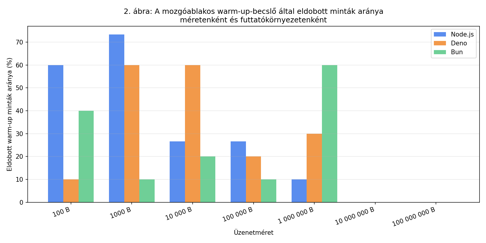
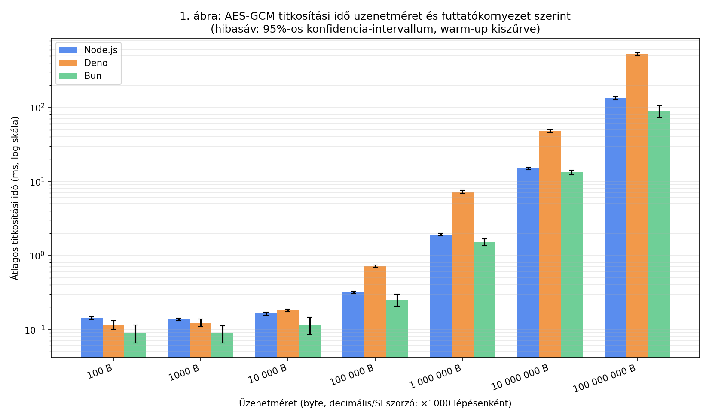

# Node.js vs. Deno vs. Bun — saját mérések

## Áttekintés

A három JavaScript futtatókörnyezet közül a **Node.js** a legrégebbi és
legérettebb, hatalmas npm ökoszisztémával. A **Deno** (ugyanattól a
fejlesztőtől, Ryan Dahl-tól, aki a Node.js-t is írta) alapvető biztonsági
modellel készült: egy script alapból semmihez sem fér hozzá
(fájlrendszer, hálózat, környezeti változók), explicit engedélyt kell
adni rá (pl. `--allow-net`), emellett natívan támogatja a TypeScript-et.
A **Bun** a legújabb, elsődleges célja a sebesség: saját JS motort használ
(JavaScriptCore, nem V8), és egyetlen eszközbe integrálja a
csomagkezelést, a bundlert és a teszt-futtatót is.

## Mérési környezet

| Paraméter | Érték |
|---|---|
| CPU | 12th Gen Intel(R) Core(TM) i5-1235U (12 mag/szál) |
| RAM | 16,9 GB |
| OS | Windows 11 23H2 (build 22631) |
| Node.js verzió | v20.10.0 |
| Deno verzió | 2.9.1 |
| Bun verzió | 1.3.14 |
| Diagramkészítő eszköz | Python, matplotlib |

## Reprodukálhatóság

A mérések a `docs/benchmarks/` mappa szkriptjeivel készültek, ugyanazon a
gépen, egymás után futtatva:

```bash
# titkosítási benchmark (100 B - 100 000 000 B, warm-up kiszűréssel)
node encrypt-benchmark-v2.mjs
deno run --allow-all encrypt-benchmark-v2.mjs
bun run encrypt-benchmark-v2.mjs

# HTTP terheléses teszt - node:http kompatibilitási réteg
node server.mjs        # ill. deno run --allow-all server.mjs / bun run server.mjs
npx autocannon -m POST -b '{"message":"teszt"}' -c 10 -d 10 http://localhost:3000

# HTTP terheléses teszt - natív API-kkal
deno run --allow-net server-deno-native.mjs
bun run server-bun-native.mjs
# (ugyanazzal az autocannon paranccsal tesztelve)
```

Az üzenetméretek **decimális (SI) szorzóval** (×1000 lépésenként: 100 B,
1000 B, 10 000 B, ...) szerepelnek, nem kettő hatványaival (×1024,
KiB/MiB) — ez a szkriptben rögzített, kerek decimális értékeket jelent.
Egy pontosabb, kettes-hatvány alapú (128, 1024, 8192, ... byte) mérési
sorozat jövőbeli finomítás lehet.

### Warm-up kiszűrés módszertana

Az `encrypt-benchmark-v2.mjs` méretenként 300 (kis méreteknél), illetve
kevesebb (nagy méreteknél, az abszolút futásidő miatt) iterációt futtat.
Egy mozgóablakos becslő (20 minta/ablak) megkeresi, hol stabilizálódik a
mért idő (egymást követő ablak-átlagok közötti relatív változás 2% alá
csökken), és az addig eltelt mintákat warm-up mintaként eldobja.

**2. ábra** a ténylegesen eldobott minták arányát mutatja méretenként és
futtatókörnyezetenként:



*2. ábra: a warm-up-becslő által eldobott minták aránya az összes
mintához képest.*

| Üzenetméret | Node.js eldobva/össz | Deno eldobva/össz | Bun eldobva/össz |
|---:|---:|---:|---:|
| 100 B | 180/300 (60%) | 30/300 (10%) | 120/300 (40%) |
| 1000 B | 220/300 (73%) | 180/300 (60%) | 30/300 (10%) |
| 10 000 B | 80/300 (27%) | 180/300 (60%) | 60/300 (20%) |
| 100 000 B | 80/300 (27%) | 60/300 (20%) | 30/300 (10%) |
| 1 000 000 B | 20/200 (10%) | 60/200 (30%) | 120/200 (60%) |
| 10 000 000 B | 0/50 (0%) | 0/50 (0%) | 0/50 (0%) |
| 100 000 000 B | 0/15 (0%) | 0/15 (0%) | 0/15 (0%) |

**Megfigyelés:** kis méreteknél jelentős (10-73%) a warm-up-nak
tulajdonított minták aránya — ez arra utal, hogy a JIT-bemelegedés
hatása itt tényleg számottevő. Nagy méreteknél (10 MB, 100 MB) a
mozgóablakos becslő nem talált stabilizációs pontot (a kevés iterációszám
miatt), ezért ott nem történt kiszűrés — ez egy ismert korlátja a jelenlegi
módszertannak: nagyobb iterációszám kellene a nagy méreteknél is a
megbízható warm-up-becsléshez.

## 1. Titkosítási művelet ideje (AES-GCM), 100 B - 100 000 000 B, warm-up kiszűrve

**1. ábra** a mért átlagos titkosítási időt mutatja, 95%-os
konfidencia-intervallummal:



*1. ábra: átlagos titkosítási idő üzenetméret és futtatókörnyezet
szerint, logaritmikus skálán. A hibasáv 95%-os konfidencia-intervallumot
jelöl (±1,96·szórás/√n), nem a nyers szórást.*

| Üzenetméret | Node.js átlag (ms) | Deno átlag (ms) | Bun átlag (ms) |
|---:|---:|---:|---:|
| 100 B | 0,142 | 0,116 | 0,090 |
| 1000 B | 0,137 | 0,123 | 0,089 |
| 10 000 B | 0,164 | 0,181 | 0,115 |
| 100 000 B | 0,317 | 0,715 | 0,253 |
| 1 000 000 B | 1,907 | 7,259 | 1,515 |
| 10 000 000 B | 14,991 | 48,112 | 13,207 |
| 100 000 000 B | 132,857 | 526,527 | 89,847 |

!!! note "Miért 95% CI és nem szórás a diagramon?"
    Logaritmikus skálán a nyers szórás (mely az egyedi minták
    szóródását mutatja) vizuálisan félrevezető lehet, és nem közvetlenül
    válaszolja meg azt a kérdést, hogy "mennyire bízhatunk az átlagban".
    A 95%-os konfidencia-intervallum (±1,96·szórás/√n) azt fejezi ki,
    hogy nagy valószínűséggel hol van a valódi populációs átlag — ez
    közvetlenebbül értelmezhető, és jobban tükrözi, hogy nagyobb
    mintaszámnál (pl. 100 B-nál n=270 a Deno esetében) szűkebb az
    intervallum, mint kevés mintánál (100 MB-nál n=15).

### Az üzenetméret és a titkosítási idő közötti összefüggés

Lineáris regressziót illesztve (`idő = a + b · méret`) mindhárom
futtatókörnyezet adataira:

| Runtime | Modell | R² | Becsült áteresztőképesség |
|---|---|---:|---:|
| Node.js | idő(ms) = 0,468 + 0,0000013 × méret(byte) | 0,99986 | ≈ 755 MB/s |
| Deno | idő(ms) = -0,263 + 0,0000053 × méret(byte) | 0,99990 | ≈ 190 MB/s |
| Bun | idő(ms) = 0,833 + 0,0000009 × méret(byte) | 0,99789 | ≈ 1119 MB/s |

**Ugyanaz a lineáris modell mindhárom futtatókörnyezetre kiválóan
illeszkedik** (R² > 0,997) — ez megfelel annak, amit egy blokk-titkosítótól
elvárunk: az idő egy fix rezsiből (`a` — kulcskezelés, API-hívás
overhead) és egy, az adatmennyiséggel arányos komponensből (`b` — a
tényleges titkosítási munka) áll össze. A `b` együttható reciproka adja
a becsült áteresztőképességet: eszerint a **Bun a leggyorsabb**
(≈1,1 GB/s), a **Node.js** középen (≈755 MB/s), a **Deno** pedig
jelentősen lassabb (≈190 MB/s) nagy adatmennyiségeknél.

### Statisztikai ellenőrzés: Node vs. Bun, 1 MB, trimmelt adatokon

A trimmelt (warm-up-mentes) mintákon Welch-féle kétmintás t-próbát
végezve (Node: n=180, átlag=1,907, szórás=0,498; Bun: n=80, átlag=1,515,
szórás=0,757):

- **t-statisztika:** 4,242
- **szabadságfok:** ≈ 110,5
- **kétoldali p-érték:** < 0,0001

A különbség erősen statisztikailag szignifikáns.

!!! warning "Mennyire normális az eloszlás valójában?"
    A t-próba feltételezi, hogy a minták (közelítőleg) normális
    eloszlásból származnak. Ennek közvetlen ellenőrzéséhez (pl.
    Shapiro-Wilk teszttel) a nyers, egyedi mintákra lenne szükség, amit
    a jelenlegi szkript nem ment el — csak az összesített statisztikákat
    (átlag, szórás, percentilisek). Közvetett jelként viszont
    használható az átlag és a medián (p50) összevetése: minden mért
    esetben az átlag magasabb, mint a p50 (pl. Node.js 1 MB-nál átlag
    1,907 ms vs. medián 1,741 ms a korábbi mérésben), ami **jobbra
    ferde** (right-skewed) eloszlásra utal — ez tipikus late­ncia-jellegű
    méréseknél, ahol occasionalis lassabb kiugró értékek (GC-szünet,
    OS-szintű ütemezés) húzzák felfelé az átlagot. Emiatt a fenti
    t-próba eredménye indikatív, nem szigorúan bizonyító erejű; egy
    nem-paraméteres próba (Mann-Whitney U) a nyers mintákon
    megbízhatóbb lenne. Ez a nyers minták mentése után egy jövőbeli
    finomítási lépés lehet.

## 2. HTTP terheléses teszt — natív API-k vs. `node:http` kompatibilitási réteg

| Runtime | API | Átlagos req/mp | Átlagos latency | p97.5 latency |
|---|---|---:|---:|---:|
| Node.js | `node:http` (natív) | 15 614,8 | 0,11 ms | 1 ms |
| Deno | `node:http` (kompat.) | 9 111,2 | 0,55 ms | 2 ms |
| Deno | `Deno.serve()` (natív) | 15 887,6 | 0,08 ms | 1 ms |
| Bun | `node:http` (kompat.) | 6 172,0 | 1,04 ms | 6 ms |
| Bun | `Bun.serve()` (natív) | 13 670,0 | 0,20 ms | 3 ms |

!!! success "A natív API-k tényleg sokat számítanak"
    A `node:http` kompatibilitási réteg helyett a saját natív API-t
    használva: **Deno** 9 111,2 → 15 887,6 req/mp (**+74,4%**), **Bun**
    6 172,0 → 13 670,0 req/mp (**+121,5%**). Natívan mérve:
    **Deno (15 887,6) ≈ Node.js (15 614,8) > Bun (13 670,0)**.

## Valós üzenetméretek kontextusa

Népszerű üzenetküldő alkalmazásoknál egy tipikus szöveges üzenet —
protokoll-overhead-del együtt — nagyságrendileg **1–3 KB**, egy
tömörített fénykép jellemzően **100 KB – 500 KB**, egy rövid hangüzenet
**tíz–száz KB** nagyságrendű. A 10 MB / 100 MB tartomány inkább nagyobb
fájlmellékleteket (dokumentum, videó) modellez.

## Következtetés a projekthez

- **Kis-közepes üzeneteknél** (100 B – 100 KB, a tipikus chat-forgalom)
  mindhárom runtime századmásodperces tartományban van.
- **Nagy payloadoknál** (1 MB+) a Bun és a Node.js következetesen
  gyorsabb, mint a Deno — ezt a lineáris modell is megerősíti (≈755 MB/s
  vs. ≈190 MB/s áteresztőképesség).
- **HTTP-terhelésnél natív API-kkal** Node.js és Deno gyakorlatilag
  egyenrangú, a Bun valamivel e mögött marad.

A projekt szempontjából a **Node.js** marad az ésszerű választás: az
érett ökoszisztéma, az npm-kompatibilitás, és a `worker_threads` modul
mind emellett szólnak, és a saját mérések alapján teljesítményben sincs
számottevő hátrányban a másik kettővel szemben.
