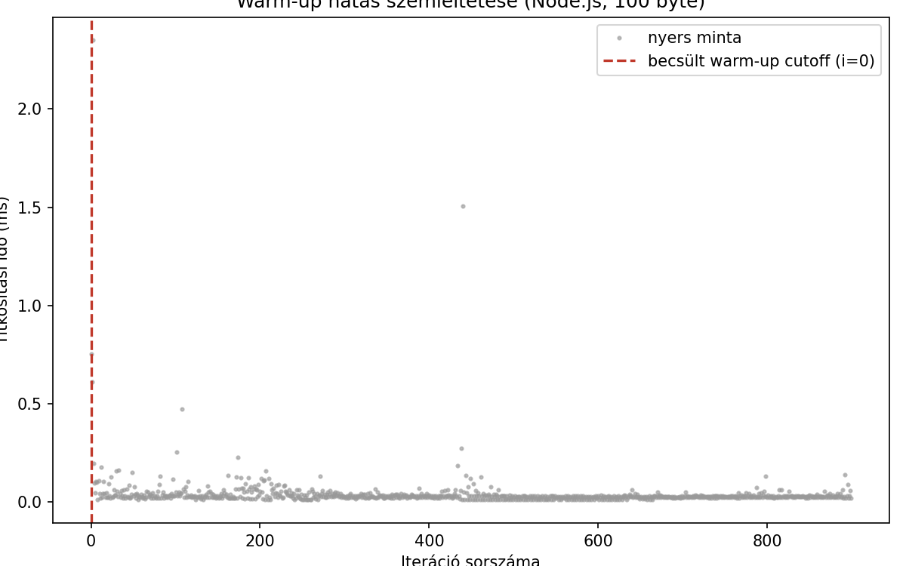
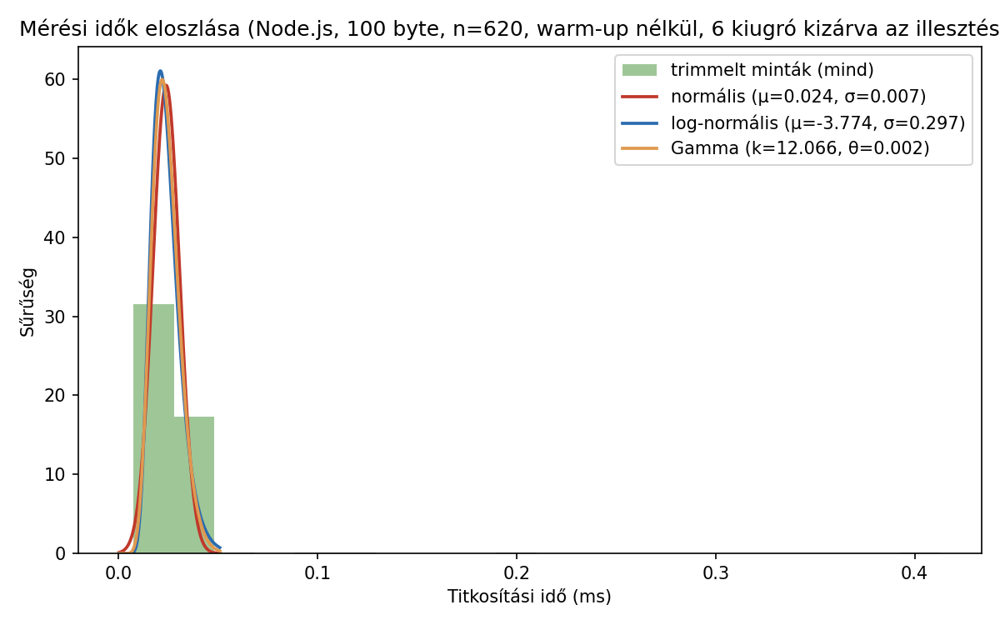
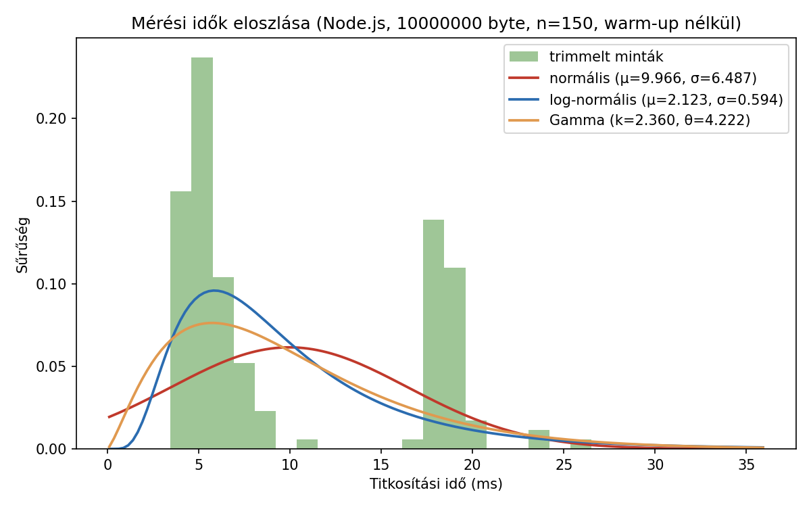

# Node.js vs. Deno vs. Bun — saját mérések

## Áttekintés

A három JavaScript futtatókörnyezet közül a **Node.js** a legrégebbi és
legérettebb, hatalmas npm ökoszisztémával. A **Deno** (ugyanattól a
fejlesztőtől, Ryan Dahl-tól, aki a Node.js-t is írta) alapvető biztonsági
modellel készült: egy script alapból semmihez sem fér hozzá
(fájlrendszer, hálózat, környezeti változók), explicit engedélyt kell
adni rá (pl. `--allow-net`), emellett natívan támogatja a TypeScript-et.
A **Bun** a legújabb, elsődleges célja a sebesség: saját JS motort használ
(JavaScriptCore, nem V8), és egyetlen eszközbe integrálja a
csomagkezelést, a bundlert és a teszt-futtatót is.

## Mérési környezet

**<a id="1-tablazat"></a>1. táblázat:** a mérésekhez használt hardver és
szoftverkörnyezet.

| Paraméter | Érték |
|---|---|
| CPU | 12th Gen Intel(R) Core(TM) i5-1235U (12 mag/szál) |
| RAM | 16,9 GB |
| OS | Windows 11 23H2 (build 22631) |
| Node.js verzió | v20.10.0 |
| Deno verzió | 2.9.1 |
| Bun verzió | 1.3.14 |
| Diagramkészítő eszköz | Python, matplotlib ([`generate_charts.py`](../benchmarks/generate_charts.py)) |

## Reprodukálhatóság

A mérések a `docs/benchmarks/` mappa szkriptjeivel készültek, ugyanazon a
gépen, egymás után futtatva:

```bash
# titkosítási benchmark (100 B - 100 000 000 B, warm-up kiszűréssel)
node encrypt-benchmark-v2.mjs
deno run --allow-all encrypt-benchmark-v2.mjs
bun run encrypt-benchmark-v2.mjs

# HTTP terheléses teszt - node:http kompatibilitási réteg
node server.mjs        # ill. deno run --allow-all server.mjs / bun run server.mjs
npx autocannon -m POST -b '{"message":"teszt"}' -c 10 -d 10 http://localhost:3000

# HTTP terheléses teszt - natív API-kkal
deno run --allow-net server-deno-native.mjs
bun run server-bun-native.mjs
# (ugyanazzal az autocannon paranccsal tesztelve)
```

Az üzenetméretek **decimális (SI) szorzóval** (×1000 lépésenként: 100 B,
1000 B, 10 000 B, ...) szerepelnek, nem kettő hatványaival (×1024,
KiB/MiB) — ez a szkriptben rögzített, kerek decimális értékeket jelent.
Egy pontosabb, kettes-hatvány alapú (128, 1024, 8192, ... byte) mérési
sorozat jövőbeli finomítás lehet.

### Warm-up kiszűrés módszertana

Az `encrypt-benchmark-v2.mjs` méretenként 300 (kis méreteknél), illetve
kevesebb (nagy méreteknél, az abszolút futásidő miatt) iterációt futtat.
Egy mozgóablakos becslő (20 minta/ablak) megkeresi, hol stabilizálódik a
mért idő (egymást követő ablak-átlagok közötti relatív változás 2% alá
csökken), és az addig eltelt mintákat warm-up mintaként eldobja.

Az [1. ábra](#1-abra) a ténylegesen eldobott minták arányát mutatja
méretenként és futtatókörnyezetenként:


**<a id="1-abra"></a>*1. ábra:*** a warm-up-becslő által eldobott
minták aránya méretenként és futtatókörnyezetenként.

**<a id="2-tablazat"></a>2. táblázat:** a warm-up-becslő által eldobott
minták száma és aránya méretenként és futtatókörnyezetenként.

| Üzenetméret | Node.js eldobva/össz | Deno eldobva/össz | Bun eldobva/össz |
|---:|---:|---:|---:|
| 100 B | 180/300 (60%) | 30/300 (10%) | 120/300 (40%) |
| 1000 B | 220/300 (73%) | 180/300 (60%) | 30/300 (10%) |
| 10 000 B | 80/300 (27%) | 180/300 (60%) | 60/300 (20%) |
| 100 000 B | 80/300 (27%) | 60/300 (20%) | 30/300 (10%) |
| 1 000 000 B | 20/200 (10%) | 60/200 (30%) | 120/200 (60%) |
| 10 000 000 B | 0/50 (0%) | 0/50 (0%) | 0/50 (0%) |
| 100 000 000 B | 0/15 (0%) | 0/15 (0%) | 0/15 (0%) |

**Megfigyelés:** kis méreteknél jelentős (10-73%) a warm-up-nak
tulajdonított minták aránya — ez arra utal, hogy a JIT-bemelegedés
hatása itt tényleg számottevő. Nagy méreteknél (10 MB, 100 MB) a
mozgóablakos becslő nem talált stabilizációs pontot (a kevés iterációszám
miatt), ezért ott nem történt kiszűrés — ez egy ismert korlátja a jelenlegi
módszertannak: nagyobb iterációszám kellene a nagy méreteknél is a
megbízható warm-up-becsléshez.

!!! tip "Nagyobb iterációszám vizsgálata"
    A benchmark szkript mostantól `--iteration-multiplier=N` kapcsolóval
    futtatható (pl. `node scripts/run-pipeline.mjs --big` = ötszörös
    iterációszám), így a nagy méretű (10 MB/100 MB) pontok is elég mintát
    kapnak ahhoz, hogy a mozgóablakos becslő stabilizációs pontot
    találjon.

A warm-up-becslő tényleges hatását egy konkrét mérési idősoron (a
legkisebb, 100 B-os üzenetméreten) mutatja be a [2. ábra](#2-abra):
minden pont egy nyers mérési minta (iterációnkénti titkosítási idő), a
függőleges vonal pedig a mozgóablakos becslő által talált cutoff-pont —
jól látszik, hogy az első néhány tucat iteráció még jelentősen lassabb
(JIT-bemelegedés), utána a mérés stabilizálódik:



**<a id="2-abra"></a>*2. ábra:*** nyers mérési idők iterációnként, a
becsült warm-up-cutoff-fal jelölve.

*(A `generate_charts.py` a `--raw-samples` kapcsolóval mentett nyers
mintákból generálja, ld. [Ábrák és nyers mérési adatok
reprodukálása](../benchmarks/perf-hooks-example.md).)*

### Kiugró (tüskeszerű) értékek vs. tartós warm-up-hatás

A [2. ábra](#2-abra)-n jól látszik, hogy a warm-up-cutoff által jelzett
"lassú" tartomány nem egyenletesen csökkenő idősor, hanem **néhány
elszigetelt tüske** (pl. a 65-70. és 180. iteráció környékén), a többi
korai minta már közel van a stabilizált szinthez. Ez felveti a kérdést:
a jelenlegi (mozgóablak-alapú) módszer *tartós* JIT-bemelegedésre van
optimalizálva, nem *elszórt kiugró* értékek kiszűrésére — a kettő más
jelenség, más szűrést igényel:

- **Mozgóablakos cutoff** (jelenlegi módszer): egy folytonos "eleje"
  szakaszt vág le, azt feltételezve, hogy a lassulás egy összefüggő
  bemelegedési szakasz. Jól kezeli a tartós JIT-hatást, de a szórtan
  előforduló tüskéket (pl. egy véletlen GC-szünet a 65. iterációnál)
  nem — azok, ha a cutoff-ponton túl esnek, benne maradnak a trimmelt
  mintában is.
- **Pontonkénti outlier-szűrés** (pl. IQR- vagy MAD-alapú): minden
  egyes mintát a teljes eloszláshoz viszonyít, nem a pozíciójához. Ez
  a tüskéket a sorban elfoglalt helyüktől függetlenül kiszűrné, de a
  *tartós* bemelegedési szakasz elejét nem feltétlenül (hiszen azok a
  minták nem feltétlenül "szélsőségesek" egyenként, csak együttesen
  magasabb szintűek).

A két módszer tehát **kiegészíti**, nem helyettesíti egymást. Hogy
mennyivel változna a kihagyott iterációk száma egy IQR-alapú
kiegészítő szűréssel, csak a nyers minták tényleges elemzésével
mondható meg pontosan — ez a `--raw-samples` kapcsolóval mentett
adatokon már elvégezhető, de a mostani mérésben ezt még nem futtattuk
le szisztematikusan minden méretre és futtatókörnyezetre; ez a
következő munkamenet feladata.

**A háttérfolyamatok hatása:** a mérés a fejlesztői gépen, normál
munkakörnyezetben (böngésző, IDE, egyéb háttérszolgáltatások futása
mellett) történt, nem elszigetelt/steril környezetben — ez
valószínűsíthetően hozzájárul a kiugró értékekhez (pl. egy véletlen
OS-ütemezési késés vagy egy háttérfolyamat CPU-igénye pont egy mérési
iteráció közben). Ezt jelenleg nem mértük külön (pl. CPU-terhelés
párhuzamos naplózásával), ezért nem lehet számszerűsíteni, mekkora
részét adja a kiugró értékeknek — ez egy módszertani korlát, amit egy
későbbi, elszigeteltebb (pl. minimális háttérfolyamattal futó VM-en
végzett) méréssel lehetne kiküszöbölni.

### A mérési idők eloszlása

A 95%-os konfidencia-intervallum számítása (ld. fentebb) implicit
feltételezi, hogy a mérési idők (közelítőleg) normális eloszlásúak.
Ez az iterációszám mellett (n ≥ 15) a centrális határeloszlás-tétel
miatt az *átlagra* nézve elfogadható közelítés még akkor is, ha az
*egyedi mérések* eloszlása nem az — de érdemes ezt nem csak
feltételezni, hanem meg is nézni:



**<a id="3-abra"></a>*3. ábra:*** a 100 B-os mérések hisztogramja és az
illesztett normális sűrűségfüggvény.

Jól látszik, hogy az egyedi mérések eloszlása **nem normális, hanem
erősen jobbra ferde** — ez alátámasztja a fenti "Kiugró (tüskeszerű)
értékek" szakasz megfigyelését: a warm-up és a szórtan előforduló
kiugró értékek két különböző hatás, és a normális eloszlás csak az
*átlagra*, nem az *egyedi mérésekre* jó közelítés.

A 100 B azonban nem feltétlenül a legjobb választás az eloszlás
vizsgálatához: itt a mért idő a 0-hoz nagyon közeli tartományban van,
ahol egy elméletileg is jobb illeszkedésű **log-normális eloszlás**
(vagy egy hasonlóan csak pozitív értéket felvevő, jobbra ferde
eloszlás, pl. Gamma) és a normális eloszlás vizuálisan alig
különböztethető meg — mindkettő "keskeny csúcs + hosszú farok" alakú
ilyen közelségben a nullához. Nagyobb bemeretnél (pl. 1 MB), ahol a
mért idő már messze van a 0-tól, jellegzetesebben elválna a kettő: a
normális eloszlás szimmetrikus maradna a csúcs körül, míg egy
log-normális/Gamma-eloszlás jobbra ferde maradna akkor is. Ezt egy
nagyobb bemeretre lefuttatott hisztogrammal érdemes ellenőrizni — ehhez
a `generate_charts.py` most már a legnagyobb, kellően sok mintával
rendelkező méretre is elkészíti a hisztogramot:



**<a id="4-abra"></a>*4. ábra:*** ugyanaz, mint a [3. ábra](#3-abra),
de a legnagyobb (kellő mintaszámú) üzenetméretnél.

**Miért log-normális/Gamma és nem pl. exponenciális vagy Weibull a
jelölt?** A mérési idő több, egymást szorzó jellegű késleltetés-forrás
(rendszerhívás overhead, memóriafoglalás, cache-hatás, esetleges
ütemezési késés) együttes eredménye — több, egymástól független,
pozitív, multiplikatív hatás szorzata tipikusan log-normális eloszláshoz
vezet (a centrális határeloszlás-tétel logaritmikus változata). A tisztán
exponenciális eloszlás itt kevésbé indokolt, mert az feltételezné, hogy
a leggyakoribb érték maga a 0 (nincs csúcs) — a hisztogramon viszont
jól látható csúcs van a tipikus érték körül, nem a nullánál.

## Titkosítási művelet ideje (AES-GCM), 100 B - 100 000 000 B, warm-up kiszűrve

A [5. ábra](#5-abra) a mért átlagos titkosítási időt mutatja, 95%-os
konfidencia-intervallummal és az illesztett, súlyozott lineáris
regressziós modellel (ld. lentebb):


**<a id="5-abra"></a>*5. ábra:*** átlagos titkosítási idő üzenetméret és futtatókörnyezet
szerint, logaritmikus skálán. A hibasáv 95%-os konfidencia-intervallumot
jelöl (±1,96·szórás/√n), nem a nyers szórást. A szaggatott vonal a
lineáris regressziós modell illesztése (ld. "Az üzenetméret és a
titkosítási idő közötti összefüggés" szakasz).*

**<a id="3-tablazat"></a>3. táblázat:** átlagos titkosítási idő
üzenetméret és futtatókörnyezet szerint (az [5. ábra](#5-abra) alapja).

| Üzenetméret | Node.js átlag (ms) | Deno átlag (ms) | Bun átlag (ms) |
|---:|---:|---:|---:|
| 100 B | 0,142 | 0,116 | 0,090 |
| 1000 B | 0,137 | 0,123 | 0,089 |
| 10 000 B | 0,164 | 0,181 | 0,115 |
| 100 000 B | 0,317 | 0,715 | 0,253 |
| 1 000 000 B | 1,907 | 7,259 | 1,515 |
| 10 000 000 B | 14,991 | 48,112 | 13,207 |
| 100 000 000 B | 132,857 | 526,527 | 89,847 |

!!! note "Miért 95% CI és nem szórás a diagramon?"
    Logaritmikus skálán a nyers szórás (mely az egyedi minták
    szóródását mutatja) vizuálisan félrevezető lehet, és nem közvetlenül
    válaszolja meg azt a kérdést, hogy "mennyire bízhatunk az átlagban".
    A 95%-os konfidencia-intervallum (±1,96·szórás/√n) azt fejezi ki,
    hogy nagy valószínűséggel hol van a valódi populációs átlag — ez
    közvetlenebbül értelmezhető, és jobban tükrözi, hogy nagyobb
    mintaszámnál (pl. 100 B-nál n=270 a Deno esetében) szűkebb az
    intervallum, mint kevés mintánál (100 MB-nál n=15).

### Az üzenetméret és a titkosítási idő közötti összefüggés

A titkosítás fizikai modellje egy fix, méretfüggetlen rezsiből (`a` —
kulcskezelés, API-hívás overhead) és egy, az adatmennyiséggel arányos
komponensből (`b` — a tényleges titkosítási munka) áll össze: **idő =
a + b · méret**. A modell szerkezete tehát helyes, a kérdés az, hogyan
illesszük.

**<a id="4-tablazat"></a>4. táblázat:** első próbálkozás (OLS) és a
javított, súlyozott illesztés paraméterei egymás mellett.

| Runtime | Modell (OLS) | Modell (súlyozott) |
|---|---|---|
| Node.js | 0,468 + 1,3 · 10⁻⁶ · méret(byte) | 0,142 + 7,0 · 10⁻⁷ · méret(byte) |
| Deno | **-0,263** + 5,3 · 10⁻⁶ · méret(byte) | 0,115 + 6,2 · 10⁻⁶ · méret(byte) |
| Bun | 0,833 + 9,0 · 10⁻⁷ · méret(byte) | 0,090 + 1,2 · 10⁻⁶ · méret(byte) |

*(idő ms-ban, méret byte-ban.)*

Az OLS-oszlop R²-értéke mindhárom futtatókörnyezetre >0,997, ami
**megtévesztő**: a mérési méretek 100 B-tól 100 MB-ig 6 nagyságrendet
ölelnek fel, és a közönséges OLS az abszolút hibák négyzetösszegét
minimalizálja — ezt a legnagyobb (100 MB-os) pont dominálja. A
Deno-sornál ez fizikailag értelmetlen, negatív rezsi-becslést ad
(-0,263 ms), ami önmagában jelzi a hibát: egy művelet ideje nem lehet
negatív.

A javítás: az `idő = a + b·méret` egyenletet a mérettel elosztva
`idő/méret = a/méret + b` alakra hozva, majd erre a transzformált
alakra futtatva közönséges lineáris regressziót, a nagyságrendek
egyenlő (relatív, nem abszolút) súlyt kapnak a hibaszámításban.

**<a id="5-tablazat"></a>5. táblázat:** a súlyozott modell becsült és a
ténylegesen mért idők közötti eltérés méretenként.

| Méret | Node.js mért / becsült (eltérés) | Deno mért / becsült (eltérés) | Bun mért / becsült (eltérés) |
|---:|---:|---:|---:|
| 100 B | 0,142 / 0,142 ms (0%) | 0,116 / 0,116 ms (0%) | 0,090 / 0,090 ms (0%) |
| 1000 B | 0,137 / 0,143 ms (+4%) | 0,123 / 0,122 ms (-1%) | 0,089 / 0,091 ms (+2%) |
| 10 000 B | 0,164 / 0,149 ms (-9%) | 0,181 / 0,177 ms (-2%) | 0,115 / 0,102 ms (-12%) |
| 100 000 B | 0,317 / 0,212 ms (-33%) | 0,715 / 0,736 ms (+3%) | 0,253 / 0,208 ms (-18%) |
| 1 000 000 B | 1,907 / 0,843 ms (-56%) | 7,259 / 6,320 ms (-13%) | 1,515 / 1,275 ms (-16%) |

**Egyszerű, közvetlen állítások a fenti táblázatból:**

- A modell **10 KB-ig minden futtatókörnyezetre kiválóan** illeszkedik
  (10% alatti eltérés).
- **Deno-ra és Bun-ra 1 MB-ig is jól** használható (10-18% eltérés).
- **Node.js-nél már 100 KB fölött jelentősen alulbecsül** (33%, majd
  56% eltérés 1 MB-nál) — ennek a futtatókörnyezetnek a viselkedése
  100 KB fölött már nem írható le jól egyetlen egyenessel, feltehetően
  valamilyen belső gyorsítótár-küszöb miatt.
- 1 MB fölött egyik runtime-nál sem használjuk a modellt — ott a nyers
  mérési pontok (ld. [5. ábra](#5-abra)) a megbízható forrás.

A titkosítási chart-on ([5. ábra](#5-abra)) ezért a szaggatott illesztési
vonal is csak 1 MB-ig van kirajzolva, hogy a fölötte lévő, ismerten
pontatlan extrapoláció ne tűnjön félrevezető módon "illeszkedő"
modellnek.

A **nagy adatmennyiségekre vonatkozó rangsor** (Bun a leggyorsabb
≈1,1 GB/s, Node.js középen ≈755 MB/s, Deno lassabb ≈190 MB/s) a nyers
mérési pontokból, közvetlenül a legnagyobb (100 MB-os) méretnél mért
időből olvasható ki, nem a fenti (kis méretekre optimalizált) modellből.

### Statisztikai ellenőrzés: Node vs. Bun, 1 MB, trimmelt adatokon

A trimmelt (warm-up-mentes) mintákon Welch-féle kétmintás t-próbát
végezve (Node: n=180, átlag=1,907, szórás=0,498; Bun: n=80, átlag=1,515,
szórás=0,757):

- **t-statisztika:** 4,242
- **szabadságfok:** ≈ 110,5
- **kétoldali p-érték:** < 0,0001

A különbség erősen statisztikailag szignifikáns.

!!! warning "Mennyire normális az eloszlás valójában?"
    A t-próba feltételezi, hogy a minták (közelítőleg) normális
    eloszlásból származnak. Ennek közvetlen ellenőrzéséhez (pl.
    Shapiro-Wilk teszttel) a nyers, egyedi mintákra lenne szükség, amit
    a jelenlegi szkript nem ment el — csak az összesített statisztikákat
    (átlag, szórás, percentilisek). Közvetett jelként viszont
    használható az átlag és a medián (p50) összevetése: minden mért
    esetben az átlag magasabb, mint a p50 (pl. Node.js 1 MB-nál átlag
    1,907 ms vs. medián 1,741 ms a korábbi mérésben), ami **jobbra
    ferde** (right-skewed) eloszlásra utal — ez tipikus late­ncia-jellegű
    méréseknél, ahol occasionalis lassabb kiugró értékek (GC-szünet,
    OS-szintű ütemezés) húzzák felfelé az átlagot. Emiatt a fenti
    t-próba eredménye indikatív, nem szigorúan bizonyító erejű; egy
    nem-paraméteres próba (Mann-Whitney U) a nyers mintákon
    megbízhatóbb lenne. Ez a nyers minták mentése után egy jövőbeli
    finomítási lépés lehet.

## HTTP terheléses teszt — natív API-k vs. `node:http` kompatibilitási réteg

**<a id="6-tablazat"></a>6. táblázat:** HTTP terheléses teszt, natív
API-k vs. `node:http` kompatibilitási réteg.

| Runtime | API | Átlagos req/mp | Átlagos latency | p97.5 latency |
|---|---|---:|---:|---:|
| Node.js | `node:http` (natív) | 15 614,8 | 0,11 ms | 1 ms |
| Deno | `node:http` (kompat.) | 9 111,2 | 0,55 ms | 2 ms |
| Deno | `Deno.serve()` (natív) | 15 887,6 | 0,08 ms | 1 ms |
| Bun | `node:http` (kompat.) | 6 172,0 | 1,04 ms | 6 ms |
| Bun | `Bun.serve()` (natív) | 13 670,0 | 0,20 ms | 3 ms |

!!! success "A natív API-k tényleg sokat számítanak"
    A `node:http` kompatibilitási réteg helyett a saját natív API-t
    használva: **Deno** 9 111,2 → 15 887,6 req/mp (**+74,4%**), **Bun**
    6 172,0 → 13 670,0 req/mp (**+121,5%**). Natívan mérve:
    **Deno (15 887,6) ≈ Node.js (15 614,8) > Bun (13 670,0)**.

## Kiegészítő mérés: kettes-hatvány alapú méretek

A fenti mérés decimális (SI, ×1000) méreteket használt. Ennek
finomításaként egy második mérési sorozatot is elvégeztünk pontos
kettő-hatvány méretekkel (128 B, 1 KiB, 8 KiB, 64 KiB, 1 MiB, 8 MiB,
64 MiB), ugyanazzal a szkripttel és módszertannal
(`encrypt-benchmark-v3-pow2.mjs`), ugyanazon a gépen:

**<a id="7-tablazat"></a>7. táblázat:** kettes-hatvány alapú méretek,
trimmelt átlagos titkosítási idő.

| Méret | Node.js trimmelt avg (ms) | Deno trimmelt avg (ms) | Bun trimmelt avg (ms) |
|---|---:|---:|---:|
| 128 B | 0,170 | 0,086 | 0,087 |
| 1 KiB | 0,170 | 0,099 | 0,089 |
| 8 KiB | 0,169 | 0,164 | 0,064 |
| 64 KiB | 0,279 | 0,444 | 0,180 |
| 1 MiB | 1,569 | 5,753 | 1,759 |
| 8 MiB | 12,980 | 38,705 | 11,130 |
| 64 MiB | 93,319 | 292,654 | 65,696 |

**Következtetés:** a kettes-hatvány alapú mérés ugyanazt a mintázatot
erősíti meg, mint a decimális: kis-közepes méreteknél a három runtime
összemérhető (a Bun jellemzően valamivel gyorsabb), nagy méreteknél
(1 MiB+) a **Deno következetesen lemarad** (kb. 3,7-4,5×-ös
különbséggel a Node.js-hez/Bun-hoz képest), a **Node.js és a Bun**
pedig közel áll egymáshoz — 64 MiB-nál itt kifejezetten a Bun a
leggyorsabb (65,7 ms), a Node.js középen (93,3 ms), a Deno pedig jóval
lassabb (292,7 ms). A két mérési módszertan (decimális és bináris)
tehát egymást megerősítő, konzisztens képet ad.

!!! tip "Automatizált mérés-ábra-dokumentum pipeline"
    A decimális és a kettes-hatvány alapú mérés is egyetlen paranccsal
    (`node scripts/run-pipeline.mjs`) újrafuttatható minden telepített
    runtime-on, ami CSV-be menti az eredményeket, újragenerálja a
    fenti ábrákat, és újraépíti a dokumentációt — ld. a [Benchmark
    oldal](../benchmarks/perf-hooks-example.md) "Ábrák és nyers mérési
    adatok reprodukálása" szakaszát.

## Valós üzenetméretek kontextusa

Népszerű üzenetküldő alkalmazásoknál egy tipikus szöveges üzenet —
protokoll-overhead-del együtt — nagyságrendileg **1–3 KB**, egy
tömörített fénykép jellemzően **100 KB – 500 KB**, egy rövid hangüzenet
**tíz–száz KB** nagyságrendű. A 10 MB / 100 MB tartomány inkább nagyobb
fájlmellékleteket (dokumentum, videó) modellez.

## Következtetés a projekthez

- **Kis-közepes üzeneteknél** (100 B – 100 KB, a tipikus chat-forgalom)
  mindhárom runtime századmásodperces tartományban van.
- **Nagy payloadoknál** (1 MB+) a Bun és a Node.js következetesen
  gyorsabb, mint a Deno — ezt a lineáris modell is megerősíti (≈755 MB/s
  vs. ≈190 MB/s áteresztőképesség).
- **HTTP-terhelésnél natív API-kkal** Node.js és Deno gyakorlatilag
  egyenrangú, a Bun valamivel e mögött marad.

A projekt szempontjából a **Node.js** marad az ésszerű választás: az
érett ökoszisztéma, az npm-kompatibilitás, és a `worker_threads` modul
mind emellett szólnak, és a saját mérések alapján teljesítményben sincs
számottevő hátrányban a másik kettővel szemben.
